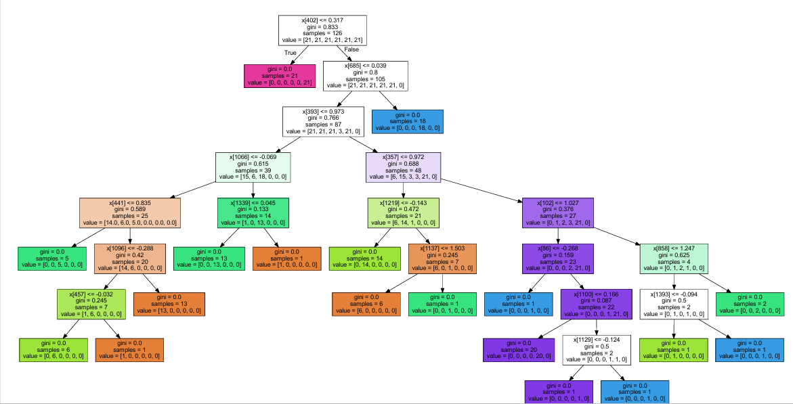

# Human Activity Recognition (HAR)

Human Activity Recognition (HAR) refers to the capability of machines to identify various activities performed by users. The knowledge acquired from these systems is integrated into applications where devices detect actions or gestures and perform predefined tasks in response.

---

## 📂 Dataset

We classify human activities based on **accelerometer data** using the **UCI-HAR dataset**.  
- The dataset can be downloaded from the [UCI Machine Learning Repository](https://archive.ics.uci.edu/ml/datasets/human+activity+recognition+using+smartphones).  
- A [YouTube video](https://www.youtube.com/watch?v=XOEN9W05_4A) of the authors collecting accelerometer data is also available for reference.  

In addition to the public dataset, I also collected my own data (`merged_data_final.csv`, `recorded_data.csv`) using the **Physics Toolbox Suite** app for experimentation and validation.

---

## ⚙️ Preprocessing

The raw accelerometer data is available in the `Inertial_Signals` folder of the dataset.  

- **CombineScript.py**: Organizes and sorts accelerometer data, creating separate classes for each activity and combining participant data.  
- **MakeDataset.py**: Reads all participant data and creates a unified dataset, which is then split into **train, test, and validation sets**.  

We focus on the **first 10 seconds of activity** (~500 samples at 50Hz).  

### Steps
1. Place `CombineScript.py` and `MakeDataset.py` in the same folder as the UCI dataset.  
2. Run `CombineScript.py` (provide paths to `train/` and `test/` folders). A new `Combined/` folder will be generated.  
3. Run `MakeDataset.py` (provide path to `Combined/`). This creates the final dataset split into train/test/validation sets.  

---

## 📊 Project Tasks & Experiments

The following experiments were conducted as part of this project:

- **Data Visualization**:  
  - Plotted waveforms of six activity classes to analyze similarities and differences.  
  - Applied PCA on total acceleration, TSFEL features, and 561-feature dataset for visualization.  
  - Compared visualization quality across raw, TSFEL, and featured data.  

- **Feature Analysis**:  
  - Generated features using **TSFEL**.  
  - Calculated correlation matrices to identify redundant features.  

- **Modeling with Decision Trees**:  
  - Trained Decision Tree models on:
    - Raw accelerometer data  
    - TSFEL features  
    - Provided dataset features  
  - Reported **accuracy, precision, recall, and confusion matrix** for each.  
  - Compared performance across the three feature representations.  
  - Analyzed decision tree depth (2–8) vs accuracy.  

- **Zero-Shot & Few-Shot Learning**:  
  - Applied Zero-Shot and Few-Shot methods for activity classification.  
  - Compared performance qualitatively and quantitatively with Decision Trees.  
  - Few-Shot learning demonstrated stronger results on collected data.  

- **Testing Model Robustness**:  
  - Evaluated model on unseen activities.  
  - Tested performance on random synthetic data with matching dimensions and range.  

- **Collected Data Experiment**:  
  - Recorded self-collected data (`merged_data_final.csv`) using smartphone accelerometer.  
  - Applied preprocessing, trimming to 10 seconds (500 samples).  
  - Predicted activities on personal data using both Decision Trees and Few-Shot prompting.  

---

## 📁 File Structure
```  
├── .gitattributes
├── .gitignore
├── CombineScript.py
├── MakeDataset.py
├── HAR_solutions.ipynb
├── merged_data_final.csv          # self-collected data
├── recorded_data.csv              # raw self-collected data
├── Combined/                      # organized dataset (train/test split)
│   ├── train/
│   └── test/
├── decision_tree.pdf              # visualization of decision tree
└── dataset.md
```
---

## 📌 Collected Data Notes

- Data was collected using **Physics Toolbox Suite**.  
- Each activity was recorded for at least **15 seconds**, trimmed to 10 seconds.  
- Sampling rate: **50Hz** (500 samples).  
- Ensured consistent phone placement and alignment across activities.  
- Collected **3–5 samples per activity class**.  

---

## 📷 Visualizations

- Example **Decision Tree** visualization:  


  
- PCA scatter plots demonstrating class separability.  
- Waveform plots showing differences between static and dynamic activities  

---

## 🚀 Key Learnings

- Importance of preprocessing accelerometer data before model training.  
- PCA as a powerful tool for visualization of high-dimensional time-series features.  
- Comparison of handcrafted features (TSFEL), raw signals, and provided dataset features.  
- Few-Shot learning can outperform classical models in scenarios with limited personal data.  

---

## ✅ Conclusion

- **Decision Trees** worked well on processed dataset features but struggled with raw signals.  
- **Few-Shot Learning** generalized better to **self-collected data** compared to Zero-Shot.  
- **PCA on featured dataset** provided the clearest class separability.  
- Proper preprocessing and consistent data collection are critical for reliable HAR models.  

---
